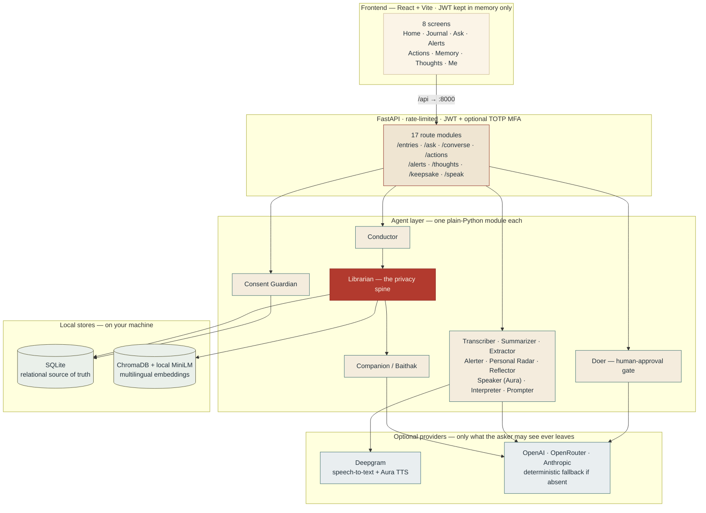
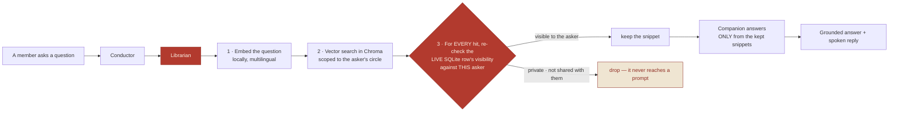
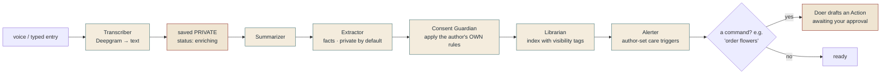
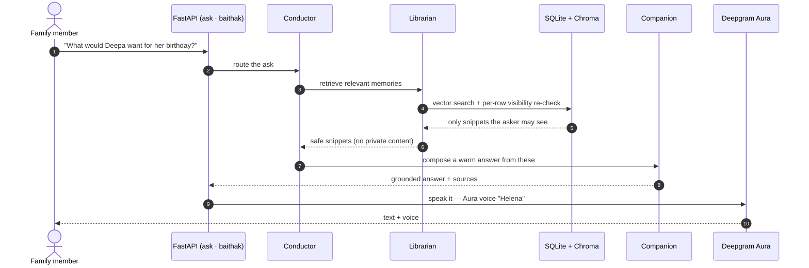
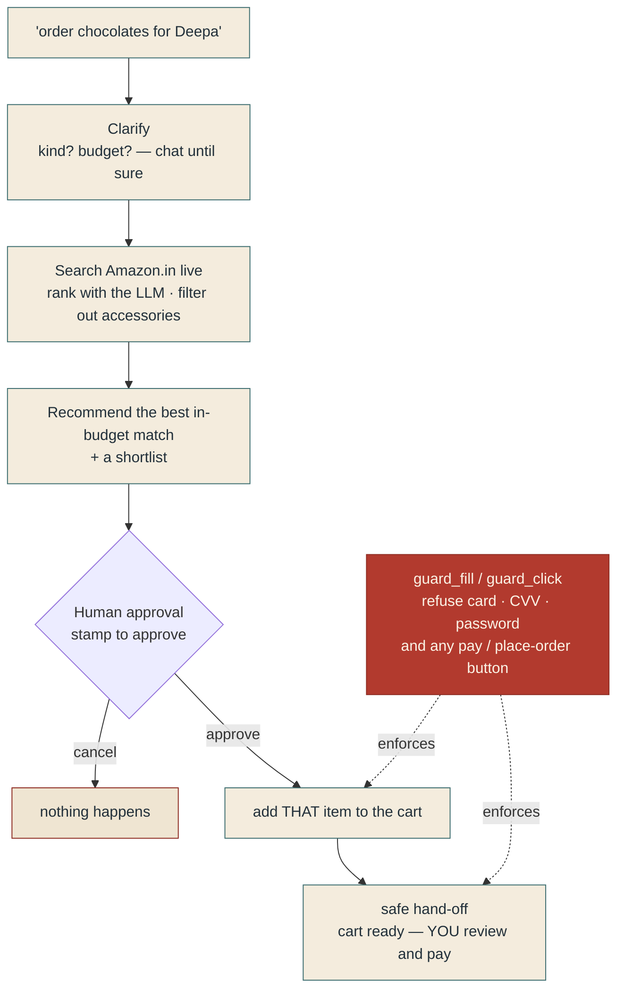

<div align="center">

# आँगन · Aangan

### A private family voice-journal — with one warm **Companion** that answers *only* from what each person chose to share.

**Built by · Vidit Bhatnagar · Aditya · Sumith Swaroop**

`FastAPI` &nbsp;·&nbsp; `SQLite` &nbsp;·&nbsp; `ChromaDB + local multilingual embeddings` &nbsp;·&nbsp; `React + Vite`
`Deepgram (STT + Aura TTS)` &nbsp;·&nbsp; `OpenRouter / OpenAI / Anthropic` &nbsp;·&nbsp; **174 tests · privacy-first**

</div>

---

*Aangan* (आँगन) means **courtyard** — the warm inner heart of a family home. Each
member keeps their own **voice journal**: ten seconds or ten minutes, whenever
they like. On top of everyone's journals sits one gentle Companion you can ask
things like *"How was Deepa's day?"* or *"What would Deepa want for her
birthday?"* — and it answers **only from what each person chose to share**.
Gentle care nudges prompt the right person to reach out, and small caring
actions (order the chocolates, draft the message) are prepared for a human to
approve and finish.

## Contents

- [Three sacred rules](#three-sacred-rules)
- [What's inside](#whats-inside)
- [System architecture](#system-architecture)
- [The privacy spine](#the-privacy-spine)
- [The capture pipeline](#the-capture-pipeline)
- [Asking the Companion](#asking-the-companion)
- [The conversational Doer](#the-conversational-doer)
- [The agent cast](#the-agent-cast) · [The eight screens](#the-eight-screens)
- [Setup and run](#setup-and-run) · [The seeded family](#the-seeded-family)
- [Privacy posture](#privacy-posture) · [The team](#the-team)

## Three sacred rules

1. **Private by default.** Every entry and every extracted fact starts private
   to its author. Visibility is enforced as a hard filter **in the retrieval
   code** — on both the relational store and the vector store, re-checked row
   by row — never as a prompt instruction.
2. **The author controls sharing.** The app may *suggest* sharing something;
   nothing moves from private to shared without the author's explicit yes, or a
   standing rule the author created themselves.
3. **A human approves and completes every real-world action.** The action agent
   prepares up to the point of payment or sending, then stops. It never enters
   card or password details — a code-level guard refuses those fields outright.

## What's inside

| | Feature | |
|---|---|---|
|  | **Voice journal** | hold-to-talk (Deepgram) or type; entries are private the instant they're spoken |
|  | **The Companion** | one warm face that answers only from shared memories, grounded in real snippets |
|  | **Baithak** | a multi-turn conversation with the Companion, remembered across turns |
|  | **My Thoughts + Personal Radar** | your own open loops, plans and gentle self-nudges — visible only to you |
|  | **Care alerts** | author-set triggers ("tell my sons if I mention my knee") — warm, never medical |
|  | **Conversational Doer** | clarifies, finds the right product on Amazon, and stops at the cart for you to pay |
|  | **Memory book** | the moments the family *chose* to share, kept together |
|  | **Bilingual** | English + हिन्दी throughout — content, replies, and the interface |
|  | **Real auth** | JWT in memory only, optional TOTP two-factor, multi-circle membership |

## System architecture

Everything runs on the server *you* run. The frontend never touches the stores
directly; every read flows through the **Librarian**, the one code path that
enforces who-can-see-what.



## The privacy spine

The single most important guarantee in Aangan: **another member's private
content is never placed into any prompt.** It isn't a request to the model —
it's enforced in code, and the spine tests (`tests/test_spine_*.py`) prove a
private entry can't leak even with corrupted vector metadata.



## The capture pipeline

A new entry is saved **private and instantly**; enrichment (summary, facts,
rules, indexing, alerts, action-detection) then runs — synchronously by
default, or in a background task when `ASYNC_CAPTURE=true` (the UI polls
`/entries/{id}/enrichment`).



## Asking the Companion



## The conversational Doer

The Doer never blindly buys the first result. It **chats to get it right**,
recommends the best in-budget match, and — only after you approve — adds *that*
item to the cart and stops. A code-level guard makes the "never pays, never
sends" promise real.



## The agent cast

Each agent is a small, plain-Python module — easy to read, test, and reason
about.

| Agent | Role |
|---|---|
|  **Conductor** | routes every ask through the agents below |
|  **Librarian** | **all** retrieval; enforces visibility on both stores, row by row |
|  **Consent Guardian** | the only code path that moves content private → shared |
|  **Companion** | the one warm face — answers only from returned snippets |
|  **Transcriber** | Deepgram speech-to-text (graceful without a key) |
|  **Summarizer** /  **Extractor** | summaries, snippets, and private-by-default facts |
|  **Alerter** | author-set triggers, severity, daily rate limits |
|  **Doer** | Playwright actions with the human-approval gate |
|  **Personal Radar** /  **Reflector** | your own open loops and gentle self-nudges |
|  **Speaker** | Deepgram Aura text-to-speech (warm neural voice) |
|  **Interpreter** | Hindi ⇄ English bridge |
|  **Prompter** / **Relationship Radar** | gentle nudges, never pushy |
|  **Keepsake** /  **Mirror** | shared memory book / private reflection |
|  **Wording Guard** | keeps alert wording warm — never medical or diagnostic |
|  **LLM** | provider chain OpenAI/OpenRouter → Anthropic → deterministic fallback |

## The eight screens

**Home** · **Journal** · **Ask** · **Alerts** · **Actions** · **Memory** ·
**Thoughts** · **Me** — one file each under `frontend/src/screens/`, styled as a
family diary of letters home (warm paper, ink serif, wax seals, postmarks).

## Setup and run

Requirements: **Python 3.11 or 3.12** (not 3.9, not 3.13), **Node 18+**.

### Backend

```bash
cd backend
python3.12 -m venv .venv
source .venv/bin/activate            # Windows: .venv\Scripts\activate
pip install -r requirements.txt
playwright install chromium          # optional — enables live cart preparation
cp .env.example .env                 # then fill in any keys you have (all optional)
python seed.py                       # the demo family + rich, presentation-ready data
uvicorn app:app --reload --port 8000 --reload-exclude 'chroma_data/*' --reload-exclude 'data/*'
```

First run downloads the local embedding model
(`paraphrase-multilingual-MiniLM-L12-v2`, ~470 MB) once, then works offline.

### Frontend

```bash
cd frontend
npm install
npm run dev                          # http://localhost:5173 (proxies /api → :8000)
```

### Verify

```bash
cd backend && .venv/bin/python -m pytest tests/ -q     # 174 tests — the privacy spine is the gate
cd frontend && npm run build                            # must compile clean
```

### Environment variables — `backend/.env`, all optional

```
DEEPGRAM_API_KEY=...     # live voice transcription + Aura text-to-speech
OPENAI_API_KEY=...       # LLM for summaries, extraction, Companion replies
OPENAI_BASE_URL=         # any OpenAI-compatible gateway, e.g. https://openrouter.ai/api/v1
OPENAI_MODEL=gpt-5.4-mini
ANTHROPIC_API_KEY=...    # alternative LLM provider (OpenAI wins if both set)
DEEPGRAM_TTS_MODEL=aura-2-helena-en   # the Companion's spoken voice
JWT_SECRET=change-me
```

**No keys? Everything still runs** on warm deterministic fallbacks (English +
Hindi); without `DEEPGRAM_API_KEY` the app offers typing instead of voice, and
the Companion uses the browser voice.

## The seeded family

Circle **Ghar** (invite code `GHAR-2026`), password `aangan123` for everyone:

| Member | Email | Language |
|---|---|---|
| Aditya (self) | `aditya@ghar.family` | en |
| Deepa (wife) | `deepa@ghar.family` | en |
| Mumma (mother) | `mumma@ghar.family` | hi |
| Abhishek (brother) | `abhishek@ghar.family` | en |

`python seed.py` builds a **full, presentation-ready portal** — 22 journal
entries across ~8 weeks, a 9-photo memory book, prepared & completed actions,
care alerts, and personal thoughts — so every dashboard, for every login, is
alive. The canonical demo still holds: log in as **Aditya**, ask
*"What would Deepa want for her birthday?"* → the Companion surfaces Deepa's
**shared** black-dress wish, while her private notes never surface for anyone.

## Privacy posture

- Family data is stored on the server you run (SQLite + local Chroma + local
  embeddings). With keys configured, only two things leave that server: audio
  goes to **Deepgram**, and questions + **only the snippets the asker may see**
  go to the LLM provider. With no keys, nothing leaves the machine. See
  `backend/legal/privacy.md`.
- Another member's private content is never placed into any prompt.
- The Mirror and My Thoughts are visible only to their owner; the memory book
  contains only shared moments.
- Aangan sends nudges so *people* connect. It is **not** a medical or emergency
  service and never presents itself as one.

## The team

<div align="center">

Designed and built with care by

### **Vidit Bhatnagar** &nbsp;·&nbsp; **Aditya** &nbsp;·&nbsp; **Sumith Swaroop**

*A private courtyard for families — built to be real, not a demo.*

</div>
